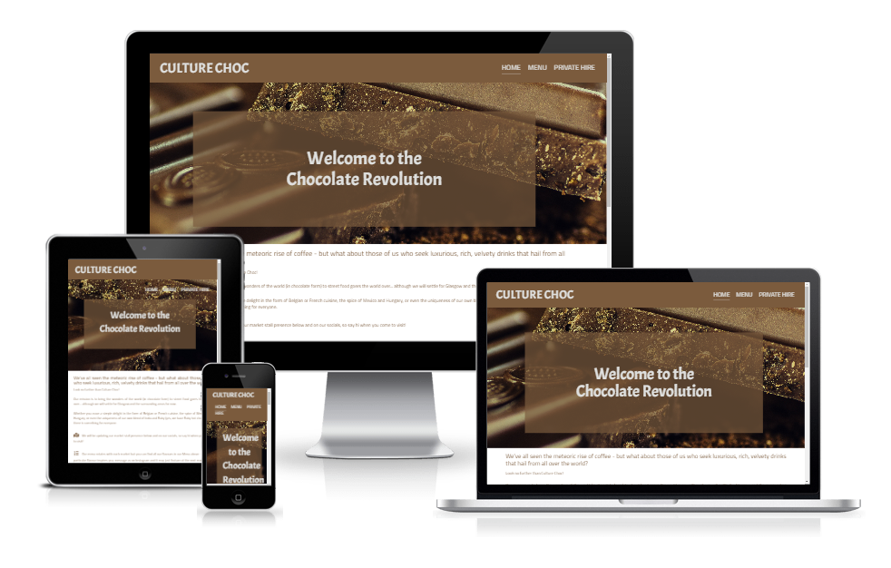

# Culture Choc 

## Table of contents

1. [Purpose of project](#purpose-of-the-project)
2. [User experience](#user-experience)
    1. [Users](#users)
    2. [User stories](#user-stories)
3. [Design](#design)
    1. [Colours](#colours)
    2. [Typography](#typography)
    3. [Imagery](#imagery)
4. [Wireframes](#wireframes)
5. [Features](#features)
6. [Technologies used](#technologies-used)
    1. [Languages used](#languages-used)
    2. [Frameworks, libraries and programmes](#frameworks-libraries-and-programmes)
7. [Code](#code)
8. [Bugs](#bugs)
9. [Testing](#testing)
    1. [Code validation](#code-validation)
    2. [Manual testing](#manual-testing)
    3. [User stories testing](#user-stories-testing)
10. [Deployment](#deployment)
11. [Credit](#credit)
12. [Feedback](#feedback)
13. [Acknowledgements](#acknowledgments)
---

### Purpose of the project

To create an information site for a new start-up food truck business that sells hot chocolates from around the world.

---

# User experience

## Users

This site will be aimed at three main user groups:
- New customers who want to know more about the business
- Existing customers looking up menu items
- Corporate/events professionals looking for a supplier

#### User stories

1. New customers
- I found this business via google or social media and want to learn more about what it is
- I want to know where I can experience this business
- I want to build an emotional connection with the founder of this business

New customers will land on this page presumably from either a google search or a reference to the business on social media. Therefore the site needs to inform them of what the business proposition is, where they can find the business and also a little bit about the background of the business. The last point will primarily serve to bring a sense of familiarity to the business once customers interact with it. With the street food market, a small sense of ownership of the business, by virtue of knowing how it came to be and its owner helps to build a bond and repeat customership.

2. Existing customers
- I am standing in front of the stall and want to know more about the menu items
- I saw this stall at a previous market and want to know which items they will be serving at the next one
- I want to know where I can find this stall next time

These customers will most likely either have spotted the business at a street food market or have seen the business before and want to check the entire menu ahead of attending an event with the stall in attendance. These customers will be much more interested in the menu side of things, however the locations and which menu items will feature will play an important role in their decision making. With this audience, the key is to relay to them more detailed information about the business so they feel included.

3. Corporate/events professionals
- I want to book a stall for my business event
- I need to make sure it doesn't completely flop
- I want to check if they can fulfil my specific requirements

Arguably, this audience needs the least depth of information. While they will want to scrutinise this business' capability and offering, this will mainly be done by word of mouth from other professionals, and so ultimately, with most business customers, they have a budget and just wish to know that the business is available on their date and fits within that budget. Therefore an easy journey towards submitting an enquiry is key.

## Design

### Colours

This website uses a 4 colour scheme, created based on the fundamental chocolate brown colour with pops of brightness so it can have stand out elements.

Basic brown - #7B5B3D
Dark brown - #402E32
Light gray - #DFE0DF
Mustard yellow - #F1962E

### Typography

This site uses Acme for headings and Cairo for body text. These two complement each other with the curve of their lettering, while the heading font has a higher weight to stand out from the relatively slim body text font. They pair nicely to create a feeling of this place being robust and delicate - just like its chocolates! 
Both of these will default to sans-serif if unavailable.

### Imagery

The imagery used is incredibly important. This site needs to represent both the class of the hot chocolate world while making it feel very approachable and calm. 

The hero image was downloaded from [Pexels](https://www.pexels.com/photo/coffee-dark-candy-chocolate-65882/) and is under Free to use for commercial or personal use purposes. The remainings imagery was all sources by the author of the page themselves and can be used for this project indefinitely.

---

## Wireframes

- [Desktop](assets/documentation/wireframes/Culture%20Choc%20desktop.png)
- [Tablet](assets/documentation/wireframes/Culture%20Choc%20mock%20tablet.png)
- [Mobile](assets/documentation/wireframes/Culture%20Choc%20mock%20mobile.png)

---
# Features

Responsive for all sites.

Interactive elements with enquiry form.  

---
# Technologies used

## Languages used
HTML5 and CSS3

## Frameworks, libraries and programmes

1. Bootstrap 5.1
I used the latest stable version of Bootstrap 5 to assist with the layout of the site and certain elements, such as the header and footer.

2. Google Fonts
I utilised the Google fonts library to import Acme and Cairo fonts.

3. Font Awesome
I used icons for the social media links in the footer.

4. GitPod
Used to create the code and sync to GitHub to push and commit.

5. GitHub
GitHub is used to store the code and repositories.

6. Adobe Illustrator
I used Adobe Illustrator to create the wireframes and the custom graphics on the page as I was very familiar with Illustrator through work and therefore was able to create these quickly and in a way that was useful to me.

7. Am I responsive?
This website was used to generate the responsive look image at the top of the README.

---

## Code

My basic structure was heavily influenced by the Love Running project and I utilised elements from this project on my Repl.it. These elements are: Nav bar styling, hero image overlay at the top of the Index page and icons for social media in footer.

## Bugs

1. Footer loses background color when responsive settings kick in.
    1. The footer did not have a set height, instead relying on Auto. This caused it to not have a size as such to apply settings to. This was fixed by adding heights, both for regular view and mobile view. Proper height was determined using DevTools.
2. Footer isn't at the bottom on form submission page.
    1. This was hacked together by applying a class to the footer on the form submission page in particular and adding a position absolute value to it. This styling wasn't applied to the entire page as it interfered with the layout of the pages with more content. 
3. Locations and menu items collapse haphazardly in mobile view.
    1. Changing the styling of these elements using a custom class specifically for responsive view (@media max-width 767.98px) so that the flex-direction was changed to column fixed this issue whereby the individual boxes stack on top of one another.
4. Header as fixed at top of page caused elements to overlap.
    1. Embarrassed it took me this long to figure out, but just had to add a margin to the top of the following element and then amend this margin for responsive view. The solution came to me when I was using DevTools and experimenting.

---

## Testing

### Code validation

All code was run through W3 validators for [HTML](https://validator.w3.org/nu/) and [CSS](https://jigsaw.w3.org/css-validator/validator).

HTML tests revealed issues with my use of alt/aria-label tags (which I now realise was a misunderstanding of their use in my knowledge) as well as use of span instead of div in header and footer stylings. My index page hero overlay was also using styling of H1 elements, where it should've used another as it was not the top level heading. Finally, a stray section was discovered in my hire page.

CSS tests revealed no errors, however did warn that import links (for my Google fonts) couldn't be validated.

### Manual testing

This page was frequently tested through Google DevTools on the browser, using the Inspect tool. This was used to test changes, apply small incremental fixes, or even experiment with options using the visual feedback as testing. 
Through this manual testing I discovered that the page started to degrade in performance only below a width of 767.98px, therefore I chose not to create any custom styling for sizes above that. 

### User stories testing

1. New customers
- I found this business via google or social media and want to learn more about what it is  
The landing page for the website extensively describes the purpose of the business, what other information can be found and also a profile of the founder.

- I want to know where I can experience this business  
The landing and private hire pages include a locations section which outlines which markets this stall will attend. The footer also includes links to social media pages.

- I want to build an emotional connection with the founder of this business  
The landing and private hire pages include a short profile of the founder.

2. Existing customers
- I am standing in front of the stall and want to know more about the menu items  
The menu page can be linked to directly and has a breakdown of each of the menu items on offer.

- I saw this stall at a previous market and want to know which items they will be serving at the next one  
The landing page includes a panel of future market stall locations as well as social media links for further information.

- I want to know where I can find this stall next time  
The landing page includes a breakdown of future locations, which can be expanded upon if further markets are available. There are also links to social media which can be used to contact the operator directly.

3. Corporate/events professionals
- I want to book a stall for my business event  
The private hire page hosts an enquiry form which can be used to contact the owner.

- I need to make sure it doesn't completely flop  
The private hire page includes location information so the potential customer can visit the stall and see it in action.

- I want to check if they can fulfil my specific requirements  
The page hosts an enquiry form which can be used to ask specific questions.

---

## Deployment

This page was deployed using GitHub pages.

To deploy:
1. Open [GitHub](https://github.com/)
2. Navigate to the repository for [Culture Choc](https://github.com/mutkovicova/culture-choc)
3. Click on Settings
4. Navigate to Pages, in the left hand side panel
5. Select 'Deploy from a branch' under Source
6. Select 'main' under Branch
7. Click the 'Save' button on the right hand side of the Branch menu.

## Credit

As mentioned previously, I utilised elements from the Love Running project earlier on in the course.

I also frequently consulted W3 schools and Stack Overflow to better understand if elements weren't working well or how I intended them to. This helped me to better understand the little features.

Finally, the Bootstrap library was absolutely instrumental in understanding this complex piece of kit that is so frequently used.

---

## Feedback

Koko, mentor - Commit history is lacking as ommits should be made much more frequently. I have completely taken this feedback on board, and feel a bit foolish for forgetting this. I applied this to my final small changes before submitting to demonstrate that I recognise this. 

---

## Acknowledgments

Koko, my mentor - thank you every so much for all the time you spent with me to make sure I got this right. Truly would not be the project it is without you, and I am so grateful for your time. And also for the fun we had!
Alex, my husband - without your support, I would never have had any time to do this project and the course, as I would've had to wrangle my 1.5 year old... that was not on the cards.
Everyone who has ever written anything that simplified how code is used - my eternal gratitude for making this field of work feel accessible and less scary.
